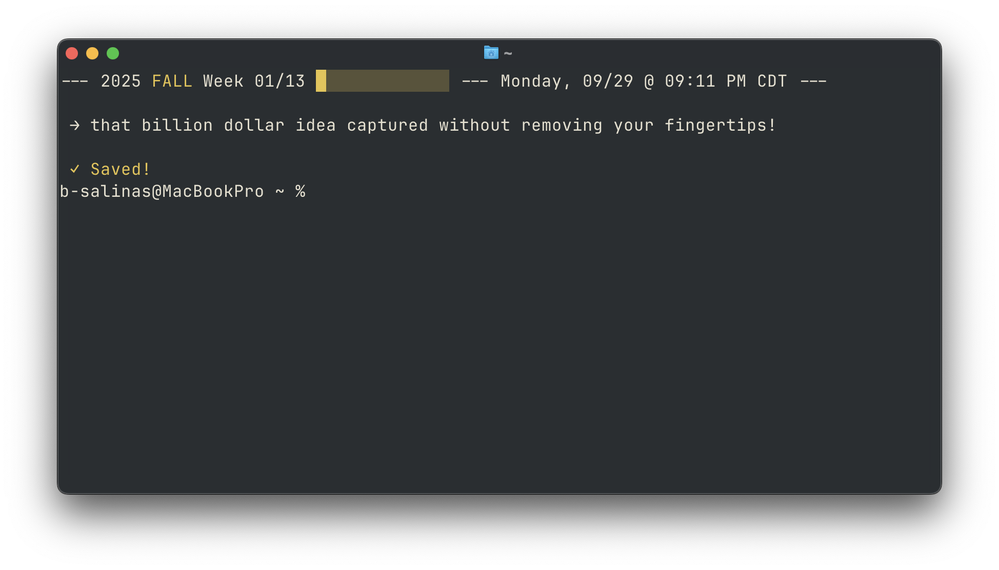
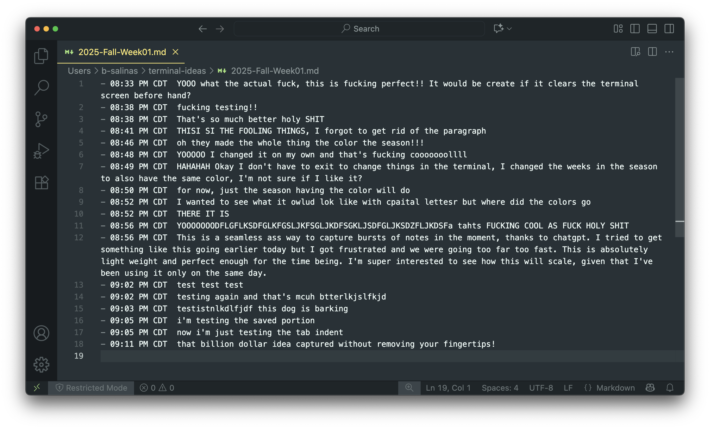

# ⋆˙⟡✧ burst-tui ✦⋆˙⟡


The ♡ of it: I wanted simple idea capture with reliable datetime tracking.

Why other notetaking apps weren't working:
* Apple Notes: On the cloud, could have a better interface - 7/10
* Sublime Notes: Slow load time, could have a better interface - 6/10
* TextEdit: Interrupts the flow of ideas right away, could ALSO have a better interface - 3/10
* Texting Myself: On the cloud, duplicate messages, slow load time - 4/10

I needed something fast, smooth, and neat to capture lightning in a bottle while working on my computer (and when I didn't have a pen and paper nearby) - so we came up with **burst**!

> *Burst utilizes my personal datetime system, focusing on `YEAR` `SEASON` `WEEK` `DAYDATE` `TIME`. I hope you enjoy it as much as I do!!!*

# Installation

1. Create a `scripts` folder in your `$HOME` Directory

2. Create **`floatnote.py`** within `scripts` folder (`scripts/floatnote.py`):

```python3
#!/usr/bin/env python3
import datetime
import os
import time
import subprocess

# Clear terminal (like Cmd+K)
subprocess.run("clear")

IDEAS_DIR = os.path.expanduser("~/terminal-ideas")

# Auto-create weekly file
now = datetime.datetime.now()
year = now.year
month = now.month
day = now.day
weekday = now.strftime("%A")

# Calculate season and week in season
season_names = ["WINTER", "SPRING", "SUMMER", "FALL"]
season_colors = {
    "WINTER": "\033[94m",  # Blue
    "SPRING": "\033[95m",  # Pink
    "SUMMER": "\033[91m",  # Red
    "FALL": "\033[33m",    # Orange/Yellow
}
reset_color = "\033[0m"

season = season_names[(month % 12) // 3]
week_in_year = now.isocalendar()[1]  # ISO week number
week_in_season = (week_in_year - 1) % 13 + 1  # 1-13
total_weeks_in_season = 13

# Progress bar (simple filled blocks)
completed = "█" * week_in_season
remaining = "░" * (total_weeks_in_season - week_in_season)
progress_bar = f"{season_colors[season]}{completed}{remaining}{reset_color}"

# File path
file_name = f"{year}-{season}-Week{week_in_season:02d}.md"
path = os.path.join(IDEAS_DIR, file_name)
os.makedirs(os.path.dirname(path), exist_ok=True)

# Current time with timezone
timestamp = time.strftime("%I:%M %p %Z")

# Floating canvas header with color + progress bar
header = (
    f"--- {year} {season_colors[season]}{season}{reset_color} "
    f"Week {week_in_season:02d}/{total_weeks_in_season} {progress_bar} "
    f"--- {weekday}, {month:02d}/{day:02d} @ {timestamp} ---\n"
)
print(header)

# Capture burst
burst = input(" → ")

# Append burst with timestamp
with open(path, "a") as f:
    f.write(f"- {timestamp}  {burst}\n")

print(f"\n {season_colors[season]}✓ Saved!{reset_color}")
```

3. Append this addition the end of your **`/.zshrc`** file: 

```zsh
export IDEAS_DIR="$HOME/terminal-ideas"
mkdir -p "$IDEAS_DIR"

# Capture a new burst
alias note='python3 ~/scripts/floatnote.py'
```

4. Start using right away with `note`!

# Picture Proof




